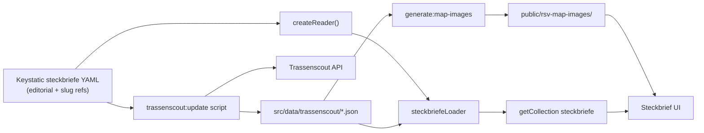

# Data sources

Steckbrief pages combine **editorial content from Keystatic** with **route geometry from Trassenscout**, checked in under `src/data/trassenscout/`.

## Architecture



| Source | What it holds |
|---|---|
| **Keystatic `steckbriefe`** (`src/data/steckbriefe/`) | Slug, title, description (RTE), planning state, from/to, length, stand, source, website, stakeholders, home teaser flags |
| **Keystatic `trassenscoutProjectSlugs`** | String refs used by the sync script to fetch from Trassenscout |
| **Checked-in `src/data/trassenscout/{slug}.json`** | Normalized geometry, aggregated API fields (`operator`, `status`, `estimatedCompletionDate`), sync metadata |
| **`public/rsv-map-images/`** | Static map PNGs for social sharing / teasers (regenerated on sync) |

The custom Astro loader in [`src/loaders/steckbriefeLoader.ts`](../src/loaders/steckbriefeLoader.ts) reads Keystatic via `createReader` and loads **checked-in** Trassenscout cache files only — no live API at build time. Steckbriefe without slugs are still published with an empty map. The sync script lives in [`scripts/trassenscout/update.ts`](../scripts/trassenscout/update.ts).

Blog posts on `/planung` and `/kommunikation` remain in Keystatic / MDX collections and are unchanged.

## Syncing Trassenscout data

Refresh checked-in geometry and map images locally:

```bash
bun run trassenscout:sync
```

This runs `trassenscout:update` (fetch from Trassenscout, write `src/data/trassenscout/`) and `generate:map-images` (MapTiler PNGs into `public/rsv-map-images/`).

A **weekly GitHub Action** (Monday 06:00 Europe/Berlin) runs the same sync and opens or updates a pull request titled **"Syncronisation mit Trassenscout"** when files change. Review the Netlify deploy preview on the PR, then merge to `main` for production (IONOS).

## What to edit where

| Want to change… | Edit in… |
|---|---|
| Page title, Kurzfassung (RTE), from/to, length, stand, source, website, stakeholders, progress state, home teaser | **Keystatic → Steckbriefe** (`/keystatic`) |
| Which Trassenscout projects appear on a page | **Keystatic → Steckbriefe → Trassenscout project slugs** |
| Route geometry (lines on map) | **Trassenscout**, then run **`bun run trassenscout:sync`** (or wait for weekly PR) |
| Subsection operator, status, completion date | **Trassenscout**, then sync |
| Blog posts Planung / Kommunikation | **Keystatic → Blog collections** |
| Page URL slug | **Keystatic → Steckbriefe → Slug** (keep existing ids for URL continuity) |
| Add a new Steckbrief | **Keystatic → Steckbriefe → New entry** (set Trassenscout slugs when geometry exists) |

**Rebuild required** after Keystatic or checked-in Trassenscout data changes. Production builds do **not** need network access to Trassenscout.

## Trassenscout API fields

Per feature, the sync script reads:

| API property | UI label |
|---|---|
| `operator` | Betreiber |
| `status` | Status (Teilabschnitt) |
| `estimatedCompletionDateString` | Voraussichtliche Fertigstellung |

For display, values from all merged features are collected, empty values dropped, deduplicated, sorted A–Z, and joined with `, `. A row is shown only when at least one non-empty value exists.

## Conventions

### Map styling: `status === "variant"`

When Trassenscout returns `status: "variant"` on a feature, it is treated as an **alternative route variant** on the map:

- Internal property: `variant: 'Alternative'` (alternate color via [`segmentColor`](../src/utils/mapColors.ts))
- **Not** a planning-progress state — does not feed the progress bar
- All other statuses: `variant: 'Vorzugstrasse'`, `discarded: false`

### Geometry normalization

- `LineString` → `MultiLineString` for MapLibre
- Feature id: `${projectSlug}-${subsectionSlug}`
- `bbox` computed via `@turf/turf`

If no cache file exists for a Steckbrief with configured slugs, the build continues with an empty map and a warning in the build log.
