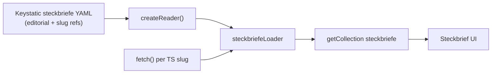

# Data sources

Steckbrief pages combine **editorial content from Keystatic** with **route geometry from Trassenscout**.

## Architecture

| Source | What it holds |
|---|---|
| **Keystatic `steckbriefe`** (`src/data/steckbriefe/`) | Slug, title, description (RTE), planning state, from/to, length, stand, source, website, stakeholders, home teaser flags |
| **Keystatic `trassenscoutProjectSlugs`** | String refs → `{baseUrl}/api/projects/{slug}.json` |
| **Trassenscout API** (fetched at build time) | GeoJSON geometry + per-feature: `operator`, `status`, `estimatedCompletionDateString` |

The custom Astro loader lives in [`src/loaders/steckbriefeLoader.ts`](../src/loaders/steckbriefeLoader.ts). It reads Keystatic via `createReader` and `fetch()`es Trassenscout when project slugs are configured. Steckbriefe without slugs are still published, but show no map until Trassenscout is linked. The Trassenscout API base URL is the constant `TRASSENSCOUT_API_BASE_URL` in [`src/lib/trassenscout/fetchProject.ts`](../src/lib/trassenscout/fetchProject.ts).

Blog posts on `/planung` and `/kommunikation` remain in Keystatic / MDX collections and are unchanged.

## What to edit where

| Want to change… | Edit in… |
|---|---|
| Page title, Kurzfassung (RTE), from/to, length, stand, source, website, stakeholders, progress state, home teaser | **Keystatic → Steckbriefe** (`/keystatic`) |
| Which Trassenscout projects appear on a page | **Keystatic → Steckbriefe → Trassenscout project slugs** |
| Route geometry (lines on map) | **Trassenscout** |
| Live subsection operator, status, completion date | **Trassenscout** |
| Blog posts Planung / Kommunikation | **Keystatic → Blog collections** |
| Page URL slug | **Keystatic → Steckbriefe → Slug** (keep existing ids for URL continuity) |
| Add a new Steckbrief | **Keystatic → Steckbriefe → New entry** (set Trassenscout slugs when geometry exists) |

**Rebuild required** after Keystatic or Trassenscout changes. The build needs network access to Trassenscout for entries with project slugs configured.

## Trassenscout API fields

Per feature, the loader reads:

| API property | UI label |
|---|---|
| `operator` | Betreiber |
| `status` | Status (Teilabschnitt) |
| `estimatedCompletionDateString` | Voraussichtliche Fertigstellung |

For display, values from all merged features are collected, empty values dropped, deduplicated, sorted A–Z, and joined with `, `. A row is shown only when at least one non-empty value exists.

## Conventions

### Map styling: `status === "variant"`

When Trassenscout returns `status: "variant"` on a feature, it is treated as an **alternative route variant** on the map:

- Internal property: `variant: 'Alternative'` (alternate color via [`segmentColor`](../src/utils/mapColors.ts))
- **Not** a planning-progress state — does not feed the progress bar
- All other statuses: `variant: 'Vorzugstrasse'`, `discarded: false`

### Geometry normalization

- `LineString` → `MultiLineString` for MapLibre
- Feature id: `${projectSlug}-${subsectionSlug}`
- `bbox` computed via `@turf/turf`

If Trassenscout fetch fails for a configured entry, the build continues with an empty map and a warning in the build log.
