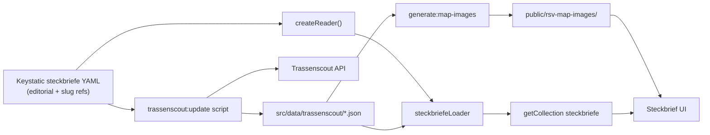

# Data sources

Steckbrief pages combine **editorial content from Keystatic** with **route geometry from Trassenscout**, checked in under `src/data/trassenscout/`.

## Architecture



| Source | What it holds |
|---|---|
| **Keystatic `steckbriefe`** (`src/data/steckbriefe/`) | Slug, title, description (RTE), planning state, from/to, length, stand, source, website, stakeholders, home teaser flags |
| **Keystatic `trassenscoutProjectSlugs`** | String refs used by the sync script to fetch from Trassenscout |
| **Checked-in `src/data/trassenscout/{slug}.json`** | Normalized geometry, aggregated API fields (`operator`, `status`, `estimatedCompletionDate`), sync metadata |
| **`public/rsv-map-images/`** | Static map PNGs for social sharing / teasers (regenerated on sync); `fallback.png` for Steckbriefe without Trassenscout geometry |

The custom Astro loader in [`src/loaders/steckbriefeLoader.ts`](../src/loaders/steckbriefeLoader.ts) reads Keystatic via `createReader` and loads Trassenscout cache files from `src/data/trassenscout/` at build time (written during sync, not fetched live by the loader). Steckbriefe without slugs are still published with an empty map. The sync script lives in [`scripts/trassenscout/update.ts`](../scripts/trassenscout/update.ts).

## When Trassenscout data is fetched

| Environment | Build command | Trassenscout |
|---|---|---|
| **Netlify CMS / preview** | `bun run build:netlify` | Syncs fresh geometry before build |
| **Production (IONOS / `main`)** | `bun run build` | Checked-in cache only |
| **Weekly sync PR** | `bun run trassenscout:sync` | Updates cache on `main` for production |

Netlify uses `build:netlify` (see [`netlify.toml`](../netlify.toml)). Production on IONOS uses plain `build`. Editorial changes in Keystatic on `develop` show maps on the next Netlify deploy without a separate sync commit; production picks up geometry when the weekly sync PR (or manual sync) is merged to `main`.

Blog posts on `/planung` and `/kommunikation` remain in Keystatic / MDX collections and are unchanged.

## Syncing Trassenscout data

### Automatic (Netlify)

Netlify runs `bun run build:netlify`, which syncs Trassenscout before `astro build`. Adding Trassenscout slugs in Keystatic is enough — the next deploy preview fetches geometry.

### Production and manual sync

Production (`bun run build` on IONOS) does **not** sync at build time. Data comes from git.

```bash
bun run trassenscout:sync
```

This runs `trassenscout:update` (fetch from Trassenscout, write `src/data/trassenscout/`) and `generate:map-images` (MapTiler PNGs into `public/rsv-map-images/` for routes with geometry, removes stale per-slug images, and refreshes `fallback.png` for the rest).

A **weekly GitHub Action** (Monday 06:00 Europe/Berlin) runs the same sync on `main` and opens or updates a pull request titled **"Syncronisation mit Trassenscout"** when files change. Review the Netlify deploy preview on the PR, then merge to `main` for production (IONOS).

**Rebuild required** after Keystatic editorial changes on production. Trassenscout geometry on production only changes after the weekly sync PR (or manual sync + commit) is merged. Netlify preview deploys use `build:netlify` and fetch Trassenscout automatically.

## What to edit where

| Want to change… | Edit in… |
|---|---|
| Page title, Kurzfassung (RTE), from/to, length, stand, source, website, stakeholders, progress state, home teaser | **Keystatic → Steckbriefe** (`/keystatic`) |
| Which Trassenscout projects appear on a page | **Keystatic → Steckbriefe → Trassenscout project slugs** |
| Route geometry (lines on map) | **Trassenscout** — on Netlify preview: automatic on next build; on production: weekly sync PR or manual **`bun run trassenscout:sync`** + commit |
| Subsection operator, status, completion date | **Trassenscout** — same as route geometry |
| Blog posts Planung / Kommunikation | **Keystatic → Blog collections** |
| Page URL slug | **Keystatic → Steckbriefe → Slug** (keep existing ids for URL continuity) |
| Add a new Steckbrief | **Keystatic → Steckbriefe → New entry** (set Trassenscout slugs when geometry exists) |

On **production**, rebuild after Keystatic or checked-in Trassenscout data changes. Use `bun run build` (no live Trassenscout fetch). Netlify uses `bun run build:netlify`.

## Trassenscout API fields

Per feature, the sync script reads:

| API property | UI label |
|---|---|
| `operator` | Betreiber |
| `status` | Status (Teilabschnitt) |
| `estimatedCompletionDateString` | Voraussichtliche Fertigstellung |

For display, values from all merged features are collected, empty values dropped, deduplicated, sorted A–Z, and joined with `, `. A row is shown only when at least one non-empty value exists.

## Planning state vs. Trassenscout status

These are **two separate fields** with no automatic mapping between them.

| | **Keystatic `state`** (Planungsstand) | **Trassenscout `status`** (per subsection) |
|---|---|---|
| Source | Editorial, in Keystatic | Trassenscout API, per feature / Teilabschnitt |
| Values | Fixed enum: `idea`, `agreement_process`, `planning`, `in_progress`, `done` | Free text from Trassenscout, e.g. `Idee`, `In Planung`, `variant` |
| Scope | Whole RSV Steckbrief | Individual route subsections |

**Keystatic `state`** drives the overall project UI:

- Progress bar on the Steckbrief page (`SteckbriefPageProgressBar`)
- State label on overview teasers (`RsvStateLabel`: Idee, Prüfung, Planung, Umsetzung, Gebaut)

**Trassenscout `status`** is used in two ways:

1. **Projektdetails** — aggregated across all linked subsections and shown as **Status (Teilabschnitt)** (see table above)
2. **Map styling** — only when `status === "variant"`: line is drawn as an alternative route (see below). All other TS status values do not affect map colours.

Saving in Keystatic updates `state` immediately on rebuild. Trassenscout `status` only changes after `bun run trassenscout:sync` (or the weekly PR).

## Conventions

### Map styling: `status === "variant"`

When Trassenscout returns `status: "variant"` on a feature, it is treated as an **alternative route variant** on the map:

- Internal property: `variant: 'Alternative'` (alternate color via [`segmentColor`](../src/utils/mapColors.ts))
- Does **not** affect Keystatic `state` or the progress bar
- The value `variant` may still appear in **Status (Teilabschnitt)** if Trassenscout returns it
- All other statuses: `variant: 'Vorzugstrasse'`, `discarded: false`

### Geometry normalization

- `LineString` → `MultiLineString` for MapLibre
- Feature id: `${projectSlug}-${subsectionSlug}`
- `bbox` computed via `@turf/turf`

If no cache file exists for a Steckbrief with configured slugs, the build continues with an empty map and a warning in the build log.
