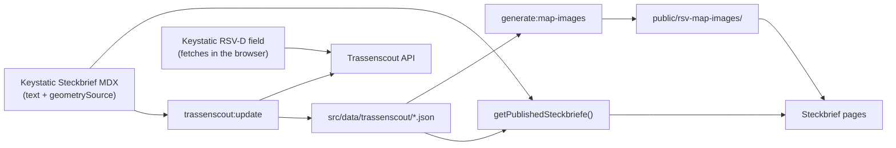

# Data sources

A Steckbrief page joins two sources at build time:

- Editorial content from Keystatic, stored as MDX in `src/data/steckbriefe/<slug>/index.mdx`.
- Route geometry and a few API fields from Trassenscout, stored as JSON in `src/data/trassenscout/<slug>.json`.

The Trassenscout JSON is checked in. Production never calls Trassenscout at build time; it only reads the checked-in files.

## How the pieces connect



Astro loads both folders as content collections (`steckbriefe` and `trassenscout`, see [src/content.config.ts](../src/content.config.ts)). [`getPublishedSteckbriefe()`](../src/lib/steckbrief/getSteckbriefTeasers.ts) joins them by slug, drops entries with `visibility: hidden`, and falls back to an empty geometry when no JSON exists for a slug. Pages must load Steckbriefe only through this function; `lint:steckbriefe` ([scripts/lintSteckbriefeCollection.ts](../scripts/lintSteckbriefeCollection.ts)) fails when another file calls `getCollection('steckbriefe')` directly.

### What each source holds

Keystatic `steckbriefe` ([cms/steckbriefe.keystatic.ts](../cms/steckbriefe.keystatic.ts)): slug, title, description, planning state, from/to, length, stand, source, website, stakeholders, home teaser flags, `visibility`, and `geometrySource`.

`src/data/trassenscout/<slug>.json`: normalized geometry, the aggregated API fields `operator`, `status` and `estimatedCompletionDate`, and sync metadata.

`public/rsv-map-images/<slug>.png`: static map for social sharing and teasers, regenerated on every sync. `fallback.png` is used for Steckbriefe without geometry.

## Geometry source (`geometrySource`)

`geometrySource` in the MDX frontmatter tells the sync where to fetch geometry from.

```yaml
geometrySource:
  discriminant: none
  value: null
# or
geometrySource:
  discriminant: projects
  value: [2-hamburg]
# or
geometrySource:
  discriminant: rsv-d
  value: [hh-2, hh-3]
```

| Discriminant | Meaning                                                | Sync behaviour                                                |
| ------------ | ------------------------------------------------------ | ------------------------------------------------------------- |
| `none`       | No Trassenscout geometry                               | No JSON file; the page shows an empty map                     |
| `projects`   | One or more Trassenscout project URL slugs             | Fetch each project, merge all features                        |
| `rsv-d`      | Subsections of the central Trassenscout project `rsv-d` | Fetch `rsv-d`, keep only the selected `subsectionSlug` values |

Each RSV-D subsection should belong to exactly one Steckbrief. This is a convention stated in the Keystatic field description; the sync does not check it.

### Picking RSV-D subsections in Keystatic

The RSV-D field ([keystatic/fields/rsvDSubsectionsField.tsx](../keystatic/fields/rsvDSubsectionsField.tsx)) has a button "Teilabschnitte aktualisieren". It fetches the `rsv-d` project JSON from Trassenscout in the browser and lists the subsections. Saving the Steckbrief commits only the selection. Geometry appears on the map after the next sync (next Netlify deploy, or the weekly PR for production).

The field only works where Keystatic runs (Netlify and local dev). Production on IONOS is a static build without `/keystatic`.

### API base URL

Sync and the RSV-D field call `https://trassenscout.de` ([src/lib/trassenscout/apiUrl.ts](../src/lib/trassenscout/apiUrl.ts)). Set `TRASSENSCOUT_API_BASE_URL` to point the sync at another instance.

## When Trassenscout is fetched

| Where                        | Command                     | Trassenscout                                       |
| ---------------------------- | --------------------------- | -------------------------------------------------- |
| Netlify (CMS and previews)   | `bun run build:netlify`     | Syncs before `astro build`                         |
| Production (IONOS, `main`)   | `bun run build`             | Not fetched; checked-in JSON only                  |
| Weekly GitHub Action         | `bun run trassenscout:sync` | Fetches and opens a PR against `main`              |
| Keystatic RSV-D field        | browser fetch               | Reads the subsection list, writes nothing to disk  |

Netlify runs `build:netlify` ([netlify.toml](../netlify.toml)), so a `geometrySource` change in Keystatic shows up on the next deploy preview without a sync commit. Production only changes when a sync PR is merged to `main`.

## Syncing Trassenscout data

```bash
bun run trassenscout:sync
```

This runs two scripts in sequence:

1. `trassenscout:update` ([scripts/trassenscout/update.ts](../scripts/trassenscout/update.ts)) fetches every Steckbrief with a `geometrySource`, writes `src/data/trassenscout/<slug>.json`, skips unchanged files, and deletes JSON files whose Steckbrief no longer has a geometry source. If some fetches fail but at least one succeeds, the script logs the failures and exits 0.
2. `generate:map-images` ([scripts/staticMapImages/generateStaticMapImages.ts](../scripts/staticMapImages/generateStaticMapImages.ts)) renders MapTiler PNGs into `public/rsv-map-images/`, removes images for slugs that no longer have geometry, and refreshes `fallback.png`.

The weekly GitHub Action ([.github/workflows/weekly-trassenscout-sync.yaml](../.github/workflows/weekly-trassenscout-sync.yaml)) runs the same command on `main` every Monday at 06:00 Europe/Berlin and opens or updates the PR "Syncronisation mit Trassenscout" on the branch `sync/trassenscout`. Review the Netlify deploy preview, then merge for production. The action can also be started by hand via `workflow_dispatch`.

Hidden Steckbriefe (`visibility: hidden`) are still synced, so switching them back to visible needs no new sync.

## What to edit where

| Want to change                                                                                       | Edit in                                                                                                                             |
| ---------------------------------------------------------------------------------------------------- | ----------------------------------------------------------------------------------------------------------------------------------- |
| Title, Kurzfassung, from/to, length, stand, source, website, stakeholders, Planungsstand, home teaser | Keystatic → Steckbriefe                                                                                                             |
| Which Trassenscout projects or RSV-D subsections feed the map                                        | Keystatic → Steckbriefe → Geometrie-Quelle                                                                                          |
| Route geometry, subsection operator, status, completion date                                         | Trassenscout. Netlify previews pick it up on the next build; production after the weekly PR or a manual `bun run trassenscout:sync` |
| Blog posts on Planung and Kommunikation                                                              | Keystatic → blog collections                                                                                                        |
| Page URL slug                                                                                        | Keystatic → Steckbriefe → Slug. Keep existing slugs; changing one breaks inbound links                                              |
| Add a Steckbrief                                                                                     | Keystatic → Steckbriefe → New entry                                                                                                 |
| Hide a Steckbrief                                                                                    | Keystatic → Sichtbarkeit → Versteckt. It stays in the CMS but gets no list card and no page after the next deploy                   |
| Delete a Steckbrief                                                                                  | Keystatic entry menu → delete. This removes `src/data/steckbriefe/<slug>/`. Prefer Versteckt unless the entry is a duplicate        |

Every change needs a rebuild to reach production. Netlify rebuilds on push; IONOS rebuilds when `main` changes.

## Trassenscout API fields

Per feature the sync reads three properties ([src/lib/trassenscout/aggregateApiFields.ts](../src/lib/trassenscout/aggregateApiFields.ts)):

| API property                    | UI label                        |
| ------------------------------- | ------------------------------- |
| `operator`                      | Betreiber                       |
| `status`                        | Status (Teilabschnitt)          |
| `estimatedCompletionDateString` | Voraussichtliche Fertigstellung |

Values from all features of a Steckbrief are trimmed, deduplicated, sorted (German locale) and joined with `, `. Empty values are dropped. A row appears in Projektdetails only when at least one value remains.

## Planning state vs. Trassenscout status

These are two separate fields. Nothing maps one to the other.

|        | Keystatic `state` (Planungsstand)                                          | Trassenscout `status`                                             |
| ------ | -------------------------------------------------------------------------- | ----------------------------------------------------------------- |
| Source | Editor picks it in Keystatic                                               | Trassenscout, per subsection                                      |
| Values | Fixed enum: `idea`, `agreement_process`, `planning`, `in_progress`, `done` | Free text from Trassenscout, e.g. `Idee`, `In Planung`, `variant` |
| Scope  | Whole Steckbrief                                                           | One subsection                                                    |

Keystatic `state` drives the progress bar on the Steckbrief page (`SteckbriefPageProgressBar`) and the label on teasers (`RsvStateLabel`: Idee, Prüfung, Planung, Umsetzung, Gebaut).

Trassenscout `status` is shown aggregated as "Status (Teilabschnitt)" and also controls map styling (next section).

## Map styling from Trassenscout status and geometry type

Trassenscout sends no dedicated flags for variants or corridors. The sync derives them from `status` and the geometry type ([src/lib/trassenscout/normalizeGeometry.ts](../src/lib/trassenscout/normalizeGeometry.ts), [src/utils/geometryKind.ts](../src/utils/geometryKind.ts)):

| Trassenscout feature                                             | Stored as                                  | Map                                                | Legend        |
| ---------------------------------------------------------------- | ------------------------------------------ | -------------------------------------------------- | ------------- |
| `Polygon` or `MultiPolygon`, any status                          | `kind: area`                               | Semi-transparent fill                              | Trassenkorridor |
| `LineString` with status `Korridor` or `corridor` (case-insensitive) | `kind: corridor`                       | Wide, rounded, semi-transparent line               | Korridor      |
| `LineString` with status `variant`                               | `kind: route`, `variant: Alternative`      | 4px line in the alternative color                  | Variante      |
| Any other `LineString`                                           | `kind: route`, `variant: Vorzugstrasse`    | 4px line in the main color                         | Vorzugstrasse |

Colors come from [`segmentColor`](../src/utils/mapColors.ts). The legend lists only the kinds present on that Steckbrief. Areas draw first, then corridors, then routes.

To mark a subsection as corridor or variant, set its status title in Trassenscout to `Korridor` or `variant`. The value then also shows up in "Status (Teilabschnitt)".

### Geometry normalization

- `LineString` becomes `MultiLineString`, `Polygon` becomes `MultiPolygon`, so MapLibre gets one geometry type per kind.
- Feature id is `${projectSlug}-${subsectionSlug}`.
- `bbox` is computed with `@turf/bbox`.
