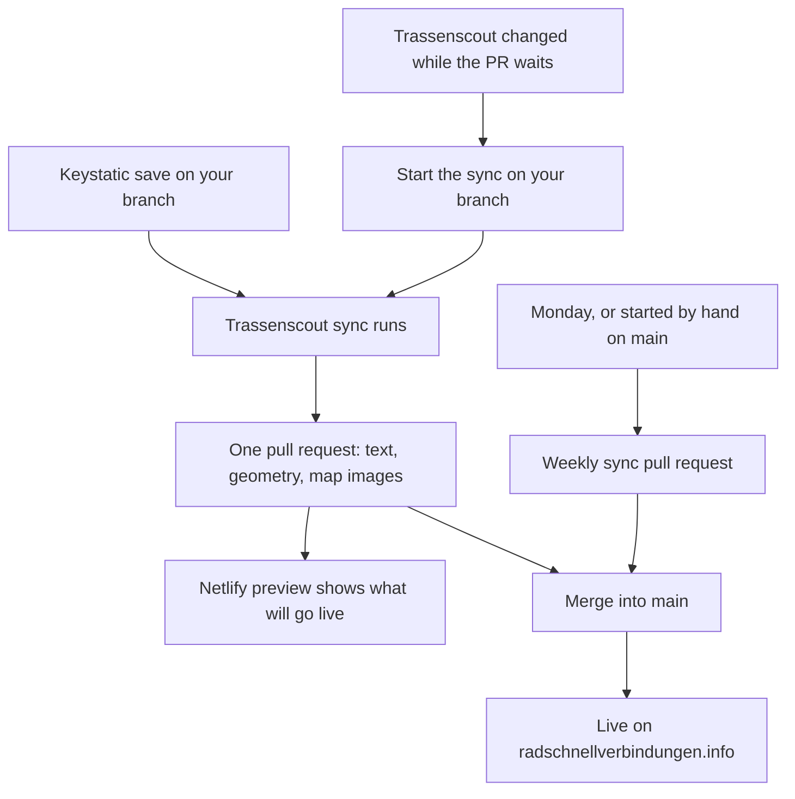

# Editorial workflow

The public site is [radschnellverbindungen.info](https://radschnellverbindungen.info/). Nothing is live there until your changes are merged into `main`.

The content comes from two places, and one pull request can carry both.

| Source | What it provides | How it reaches the public site |
| --- | --- | --- |
| [Trassenscout](https://trassenscout.de) | Route geometry, section status, operator, completion date, and the map images | Synced automatically onto your Keystatic branch, or through the weekly sync pull request |
| [Keystatic](https://rsv-info-cms.netlify.app/keystatic) | Steckbrief text, visibility, Geometrie-Quelle, Planung/Kommunikation posts | Save on a branch, then a pull request. Saving directly to `main` is blocked. |

How Steckbrief text and Trassenscout data are joined technically: [DATA.md](./DATA.md).

## Sites and logins

- **CMS — this is where you edit:** [rsv-info-cms.netlify.app/keystatic](https://rsv-info-cms.netlify.app/keystatic)
- **CMS site (a working copy, not the public site):** [rsv-info-cms.netlify.app](https://rsv-info-cms.netlify.app/)
- **Public site:** [radschnellverbindungen.info](https://radschnellverbindungen.info/) — hosted on IONOS, has no `/keystatic`
- **GitHub repository:** [FixMyBerlin/rsv-info](https://github.com/FixMyBerlin/rsv-info)
- **Open pull requests:** [github.com/FixMyBerlin/rsv-info/pulls](https://github.com/FixMyBerlin/rsv-info/pulls)
- **Trassenscout sync:** [the sync Action on GitHub](https://github.com/FixMyBerlin/rsv-info/actions/workflows/weekly-trassenscout-sync.yaml)

You sign in to Keystatic with your GitHub account, and you need access to this repository (through the GitHub App [rsv-info-cms](https://github.com/organizations/FixMyBerlin/settings/apps/rsv-info-cms)). Every save is written to GitHub in your name.

## Complete release (text and maps)

This is the usual way to publish. It has three parts: edit, pull request with preview, release.

### Part 1: Edit

1. Open [Keystatic](https://rsv-info-cms.netlify.app/keystatic).
2. Create a **new branch**. Saving to `main` is blocked, so a branch is always needed.
3. Edit Steckbriefe and save as often as you like. Every save of a Steckbrief also starts the **Trassenscout sync** on your branch: it fetches the current data for the Geometrie-Quelle set on that branch and adds the geometry and map images to the same branch whenever they changed.

You also edit **Planung** and **Kommunikation** posts in the same place. Those saves do not start the sync, because it only reacts to Steckbrief files. Geometry and map images stay as they are; the rest of the workflow (Part 2 and Part 3) is the same.

### Part 2: Pull request and preview

4. When you are done editing, open a **pull request** to `main` — Keystatic offers this, or you can [do it on GitHub](https://github.com/FixMyBerlin/rsv-info/compare). Open it when you are ready for a final review, not in the middle of many small saves.
5. Wait for the **Netlify preview** on the pull request. This is the first place where you see text and maps exactly as they will go live: it is built from the files on your branch, the same way the public site is built. If the sync is still running, the preview may still show the previous map images — check again once the sync has added its changes.

**FYI:** Every further change on the branch starts a new Netlify preview build.

### Part 3: Release

6. Merge the pull request. The public site is rebuilt from `main` and your changes go live.

### Scenario: Trassenscout changed while the pull request is waiting

The sync only runs when a Steckbrief is saved, or when you start it by hand. So if your pull request has been open for a while and nobody saved anything, newer Trassenscout data will not show up on its own and the preview keeps showing the maps from the last sync.

The easiest fix is to open the Steckbrief in Keystatic and save it once more, even without changing anything. If you would rather start the sync on GitHub:

1. Open [Trassenscout sync](https://github.com/FixMyBerlin/rsv-info/actions/workflows/weekly-trassenscout-sync.yaml).
2. Click **Run workflow**.
3. Leave **Use workflow from** on `main` — this only selects the version of the Action, not the content you sync.
4. Enter your Keystatic branch name under **branch** (for example `sn-variant`).
5. Click **Run workflow** to start it.

### Scenario: Two branches change the same Steckbrief

Work on one Steckbrief in one branch at a time. If two pull requests touch the same route, both try to write the same map image and GitHub reports a conflict.

Merge one pull request first. Then, on the other one, click **Update branch** on GitHub to pull in the current `main`, and start the Trassenscout sync on that branch again. The map image is written fresh and the conflict disappears.

### Scenario: You are asked to edit the weekly sync pull request

Do not put Keystatic edits there. The branch behind the “Syncronisation mit Trassenscout” pull request is reserved for geometry coming from Trassenscout. Editorial changes always belong on a new branch of your own.

## Publish new geometry only (weekly sync)

Use this when the text is fine and you only want the current Trassenscout data on the public site. If the data itself is still wrong, correct it in [Trassenscout](https://trassenscout.de) first.

Every **Monday at 06:00 (Berlin time)** the sync runs on its own and collects all Trassenscout changes into the pull request **Syncronisation mit Trassenscout**. It never touches Keystatic text.

1. Find **Syncronisation mit Trassenscout** in the [list of pull requests](https://github.com/FixMyBerlin/rsv-info/pulls).
2. Review the Netlify preview.
3. Merge it when you want that data on the public site.

You do not have to merge every week. The next run adds its changes to the same pull request, and once you have merged it, the following run opens a new one. When nothing changed in Trassenscout, there is no pull request at all.

If you do not want to wait for Monday, start it by hand: open [Trassenscout sync](https://github.com/FixMyBerlin/rsv-info/actions/workflows/weekly-trassenscout-sync.yaml), click **Run workflow**, and enter `main` as the branch.

## Hide a Steckbrief

To take a Steckbrief off the public site without deleting it, set **Sichtbarkeit** to **Versteckt** in Keystatic and then go through Part 2 and Part 3 as usual. Prefer this over deleting: the entry stays in the CMS and keeps its Trassenscout data, so you can bring it back at any time.

## Where you see which content

| | CMS site | Preview on a pull request | Public site |
| --- | --- | --- | --- |
| Steckbrief text | As merged into `main` | Your branch | As merged into `main` |
| Trassenscout data and maps | Always current, fetched while building | The data synced onto your branch | The data merged into `main` |
| Keystatic editing | Yes | No | No |

## Setup notes (maintainers)

The sync needs the repository secret `TRASSENSCOUT_SYNC_TOKEN`: a fine-grained PAT (or GitHub App installation token) with `contents:write` and `pull-requests:write`. The default `GITHUB_TOKEN` would not trigger CI on the sync commit.

In Netlify, keep “cancel stale deploy previews” enabled, so the preview built before the sync commit is dropped and only the up-to-date one remains.

In the IONOS Deploy Now UI, keep auto-staging for other branches turned off, so a CMS branch can never be deployed by accident.
