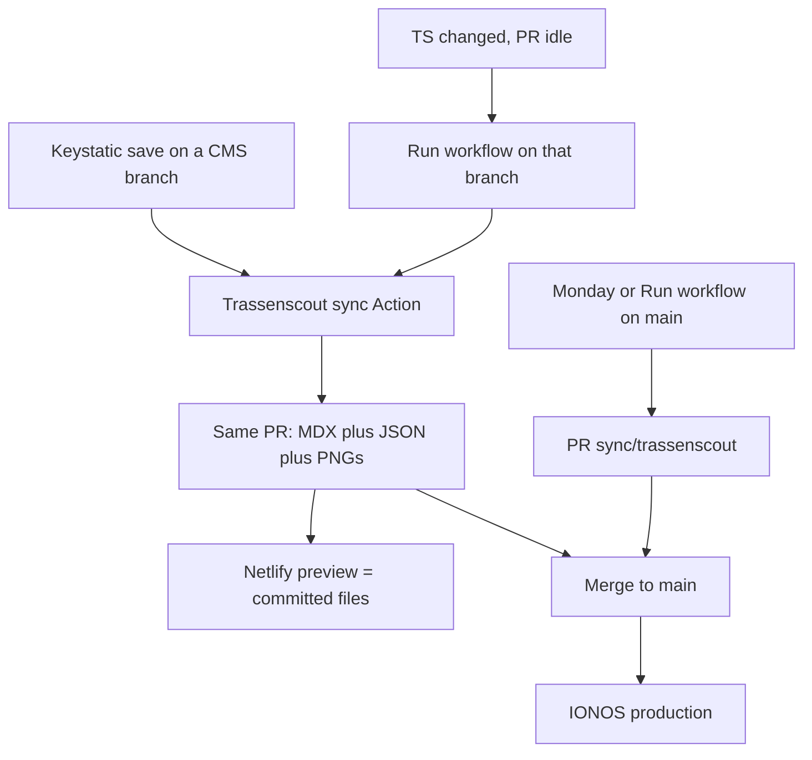

# Editorial workflow

Production is [radschnellverbindungen.info](https://radschnellverbindungen.info/). Nothing is live there until it is on `main`.

There are two jobs. They can share one pull request.

| Source | What it changes | How it reaches `main` |
| --- | --- | --- |
| [Trassenscout](https://trassenscout.de) | Route geometry, subsection status, operator, completion date, and the static map images | Auto-sync onto a Keystatic branch, or the weekly/manual PR from `main` |
| [Keystatic](https://rsv-info-cms.netlify.app/keystatic) | Steckbrief text, visibility, geometry source, Planung/Kommunikation posts | Keystatic save on a branch → pull request (do not save straight to `main` unless you intend to go live immediately) |

Technical join of Steckbrief MDX and Trassenscout JSON: [DATA.md](./DATA.md).

## Sites and logins

- **CMS (edit here):** [rsv-info-cms.netlify.app/keystatic](https://rsv-info-cms.netlify.app/keystatic)
- **CMS workbench (not production):** [rsv-info-cms.netlify.app](https://rsv-info-cms.netlify.app/)
- **Production:** [radschnellverbindungen.info](https://radschnellverbindungen.info/) — static IONOS build, no `/keystatic`
- **GitHub repo:** [FixMyBerlin/rsv-info](https://github.com/FixMyBerlin/rsv-info)
- **Open pull requests:** [github.com/FixMyBerlin/rsv-info/pulls](https://github.com/FixMyBerlin/rsv-info/pulls)
- **Trassenscout sync Action:** [Weekly Trassenscout sync](https://github.com/FixMyBerlin/rsv-info/actions/workflows/weekly-trassenscout-sync.yaml) (display name: **Trassenscout sync**)

Keystatic uses GitHub mode. Sign in with GitHub. You need access to this repository (GitHub App [rsv-info-cms](https://github.com/organizations/FixMyBerlin/settings/apps/rsv-info-cms)). Saving writes commits through that app.

In the Netlify UI, turn on cancelling stale Deploy Previews so the first (MDX-only) preview is dropped when the sync commit arrives. That is optional; the second preview is the one that matches production.

## Complete release (Keystatic branch)

This is the usual way to ship text and maps together.

1. Open the [Keystatic admin](https://rsv-info-cms.netlify.app/keystatic).
2. Create a **new branch**. Do not save to `main` unless you want to go live immediately.
3. Edit Steckbriefe and save. Each save of files under `src/data/steckbriefe/` starts **Trassenscout sync** on that branch. The Action fetches Trassenscout using this branch’s Geometrie-Quelle and commits JSON plus map images onto the **same** branch when they changed.
4. Open a **pull request** into `main` (Keystatic can open it, or use [GitHub](https://github.com/FixMyBerlin/rsv-info/compare)).
5. Review the **Netlify deploy preview**. Deploy Previews use `bun run build` (checked-in JSON), same as IONOS. Until the first sync commit lands, maps can still be the old files; after that, the preview is what production will ship.
6. Merge. IONOS deploys from `main`.

Changing **Geometrie-Quelle** is enough: the next Steckbrief save on that branch syncs the new selection. Do not run the weekly job from `main` for that.

Blog posts (Planung / Kommunikation) do not trigger the Action. Geometry is unchanged.

### Trassenscout changed, PR is idle

Nothing pushes, so auto-sync does not run. Either save once more in Keystatic, or:

1. Open [Trassenscout sync](https://github.com/FixMyBerlin/rsv-info/actions/workflows/weekly-trassenscout-sync.yaml).
2. **Run workflow**.
3. **Use workflow from `main`** — that dropdown is the YAML version, not the content branch.
4. Set **branch** to the Keystatic branch name (e.g. `sn-variant`).
5. **Run workflow**.

### Two open CMS branches on the same Steckbrief

Both may rewrite the same `public/rsv-map-images/<slug>.png`. Merge one first, update the other from `main` (rebase or merge), then **Run workflow** on that branch so the PNG is regenerated and the conflict goes away.

Do not put Keystatic edits on `sync/trassenscout`.

New Keystatic branches only auto-sync after this workflow file is on `main`. An older branch (for example `sn-variant`) needs a rebase onto `main`, or one manual Run workflow, until then.

## Geometry-only (weekly)

Once a week the same Action runs on **Monday at 06:00 Europe/Berlin** from `main`. It opens or **updates** the pull request **Syncronisation mit Trassenscout** on the fixed branch `sync/trassenscout`. It does not copy Keystatic text.

1. Open [pull requests](https://github.com/FixMyBerlin/rsv-info/pulls) and find **Syncronisation mit Trassenscout**.
2. Check the Netlify deploy preview.
3. Merge when you want that geometry on production.

Skipping a week is fine. The next run **updates the same open PR**. If the previous PR was already merged, a new PR is created. If Trassenscout did not change, there is no PR.

To run it by hand from `main`: same Action → Run workflow → **Use workflow from `main`** → branch **`main`**.

Those PRs skip Dependency Review and `check-ci`; GitHub runs `bun run build` (same as IONOS). IONOS still deploys only after merge to `main`.

## What is live where

| | Netlify CMS (`main`) | Netlify PR preview | IONOS production |
| --- | --- | --- | --- |
| Keystatic text | `main` | The PR branch | Last merge to `main` |
| Trassenscout maps | Fetched live at build time | Checked-in JSON on the PR | Checked-in JSON on `main` |
| `/keystatic` | Yes | No (static preview) | No |

## Checklist

**Ship a complete release (text and maps)**

1. [Keystatic](https://rsv-info-cms.netlify.app/keystatic) → new branch, edit, save. Wait for the sync commit if maps should change.
2. Open a PR, review the Netlify preview after that commit.
3. Merge.

**Ship current Trassenscout data only**

1. [Optional] Edit in [Trassenscout](https://trassenscout.de).
2. Wait for Monday, or [run Trassenscout sync](https://github.com/FixMyBerlin/rsv-info/actions/workflows/weekly-trassenscout-sync.yaml) with branch `main`.
3. Review the Netlify preview on [the sync PR](https://github.com/FixMyBerlin/rsv-info/pulls).
4. Merge.

**Hide a Steckbrief** without deleting it: Keystatic → Sichtbarkeit → Versteckt, then merge. Prefer that over deleting the entry.

## Repo setup (maintainers)

The Action needs the repository secret `TRASSENSCOUT_SYNC_TOKEN`: a fine-grained PAT (or GitHub App installation token) with `contents:write` and `pull-requests:write`. The default `GITHUB_TOKEN` does not trigger CI on the bot commit.

In the IONOS Deploy Now UI, turn off auto-staging for stray branches so a reverted YAML cannot deploy CMS branches again.
