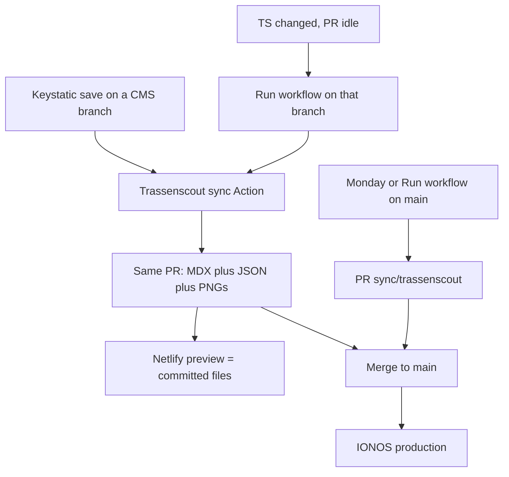

# Editorial workflow

Production is [radschnellverbindungen.info](https://radschnellverbindungen.info/). Nothing is live there until it is on `main`.

There are two jobs. They can share one pull request.

| Source | What it changes | How it reaches `main` |
| --- | --- | --- |
| [Trassenscout](https://trassenscout.de) | Route geometry, subsection status, operator, completion date, and the static map images | Auto-sync onto a Keystatic branch, or the weekly/manual PR from `main` |
| [Keystatic](https://rsv-info-cms.netlify.app/keystatic) | Steckbrief text, visibility, geometry source, Planung/Kommunikation posts | Keystatic save on a branch → pull request. Direct pushes to `main` are blocked. |

Technical join of Steckbrief MDX and Trassenscout JSON: [DATA.md](./DATA.md).

## Sites and logins

- **CMS (edit here):** [rsv-info-cms.netlify.app/keystatic](https://rsv-info-cms.netlify.app/keystatic)
- **CMS workbench (not production):** [rsv-info-cms.netlify.app](https://rsv-info-cms.netlify.app/)
- **Production:** [radschnellverbindungen.info](https://radschnellverbindungen.info/) — static IONOS build, no `/keystatic`
- **GitHub repo:** [FixMyBerlin/rsv-info](https://github.com/FixMyBerlin/rsv-info)
- **Open pull requests:** [github.com/FixMyBerlin/rsv-info/pulls](https://github.com/FixMyBerlin/rsv-info/pulls)
- **Trassenscout sync Action:** [Weekly Trassenscout sync](https://github.com/FixMyBerlin/rsv-info/actions/workflows/weekly-trassenscout-sync.yaml) (display name: **Trassenscout sync**)

Keystatic uses GitHub mode. Sign in with GitHub. You need access to this repository (GitHub App [rsv-info-cms](https://github.com/organizations/FixMyBerlin/settings/apps/rsv-info-cms)). Saving writes commits through that app.

In the Netlify UI, turn on cancelling stale Deploy Previews so the first (MDX-only) preview is dropped when the sync commit arrives. That is optional; the second preview is the one that matches production.

## Complete release (Keystatic branch)

This is the usual way to ship text and maps together.

### Part 1: Edit

1. Open the [Keystatic admin](https://rsv-info-cms.netlify.app/keystatic).
2. Create a **new branch**. Direct pushes to `main` are blocked, so a branch is required.
3. Edit Steckbriefe and save. Each save of files under `src/data/steckbriefe/` starts **Trassenscout sync** on the new branch you created. The Action fetches Trassenscout using that branch’s Geometrie-Quelle and commits JSON plus map images onto the **same** branch when they changed.

The same Keystatic admin also edits **Planung** and **Kommunikation** posts. Those saves do not start Trassenscout sync, because the Action only watches Steckbrief files. Route geometry and map images stay as they were; you still open a pull request (Part 2) to preview and ship the post text.

### Part 2: Pull request and preview

4. When the edits are done, open a **pull request** into `main` (Keystatic can open it, or use [GitHub](https://github.com/FixMyBerlin/rsv-info/compare)). Open it once you want a **last round of checks**, not in the middle of many small saves.
5. Wait until Netlify has created the **deploy preview**. That preview is the first place to review text and maps together. Deploy Previews use `bun run build` (checked-in JSON), same as IONOS. Until the first sync commit lands, maps can still be the old files; after that, the preview is what production will ship.

**FYI:** Every later push on the branch starts a **new** Netlify deploy.

### Part 3: Release

6. Merge. IONOS deploys from `main`.

### Scenario: Trassenscout changed while the PR is waiting

Auto-sync only runs when someone saves a Steckbrief (or when you start the Action by hand). If your pull request is already open and nobody saves again, new Trassenscout data does **not** appear on the branch. The preview still shows the last synced maps.

To pick up the new geometry, save the Steckbrief once more in Keystatic (even without text changes). That starts sync on your branch again. If you prefer GitHub instead:

1. Open [Trassenscout sync](https://github.com/FixMyBerlin/rsv-info/actions/workflows/weekly-trassenscout-sync.yaml).
2. **Run workflow**.
3. **Use workflow from `main`** — that dropdown is the version of the Action, not the content branch.
4. Set **branch** to the Keystatic branch name (e.g. `sn-variant`).
5. **Run workflow**.

### Scenario: Two branches for the same Steckbrief

Work on one Steckbrief in **one** Keystatic branch at a time. If two pull requests both change the same route, they both try to update the same map image. GitHub then shows a conflict.

Merge one PR first. On the remaining PR, use GitHub’s **Update branch** (bring in the latest `main`), then run **Trassenscout sync** on that Keystatic branch so the map image is written again and the conflict goes away.

### What to do: Do not edit the weekly sync branch

Keystatic edits belong on a **new** CMS branch. Do not save onto `sync/trassenscout` (the weekly “Syncronisation mit Trassenscout” PR). That branch is only for geometry from Trassenscout.

## Geometry-only (weekly)

Use this when you only need current Trassenscout geometry on production, with no Keystatic text changes. Edit in [Trassenscout](https://trassenscout.de) first if the source data is still wrong.

Once a week the same Action runs on **Monday at 06:00 Europe/Berlin** from `main`. It opens or **updates** the pull request **Syncronisation mit Trassenscout** on the fixed branch `sync/trassenscout`. It does not copy Keystatic text.

1. Open [pull requests](https://github.com/FixMyBerlin/rsv-info/pulls) and find **Syncronisation mit Trassenscout**.
2. Check the Netlify deploy preview.
3. Merge when you want that geometry on production.

Skipping a week is fine. The next run **updates the same open PR**. If the previous PR was already merged, a new PR is created. If Trassenscout did not change, there is no PR.

To run it by hand from `main` (instead of waiting for Monday): same Action → Run workflow → **Use workflow from `main`** → branch **`main`**.

Those PRs skip Dependency Review and `check-ci`; GitHub runs `bun run build` (same as IONOS). IONOS still deploys only after merge to `main`.

## Hide a Steckbrief

To take a Steckbrief off the public site without deleting it: in Keystatic set **Sichtbarkeit** to **Versteckt**, then follow Part 2 and Part 3 (pull request, preview, merge). Prefer that over deleting the entry. Hidden entries stay in the CMS and still sync from Trassenscout, so you can show them again later without rebuilding geometry.

## What is live where

| | Netlify CMS (`main`) | Netlify PR preview | IONOS production |
| --- | --- | --- | --- |
| Keystatic text | `main` | The PR branch | Last merge to `main` |
| Trassenscout maps | Fetched live at build time | Checked-in JSON on the PR | Checked-in JSON on `main` |
| `/keystatic` | Yes | No (static preview) | No |

## Repo setup (maintainers)

The Action needs the repository secret `TRASSENSCOUT_SYNC_TOKEN`: a fine-grained PAT (or GitHub App installation token) with `contents:write` and `pull-requests:write`. The default `GITHUB_TOKEN` does not trigger CI on the bot commit.

In the IONOS Deploy Now UI, turn off auto-staging for stray branches so a reverted YAML cannot deploy CMS branches again.
